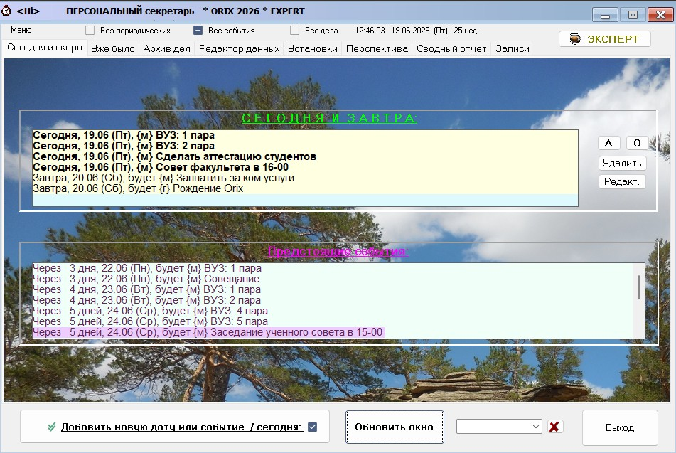
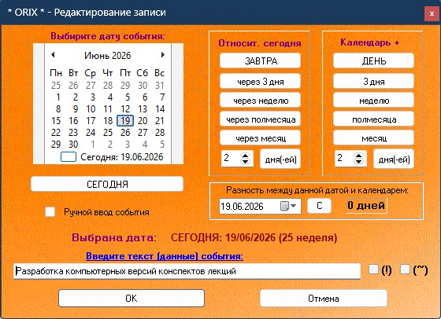
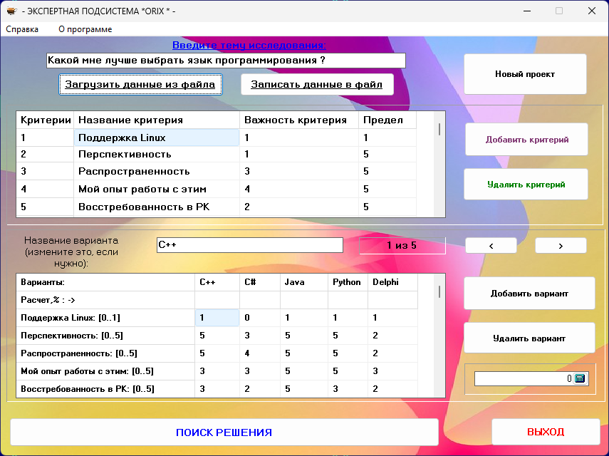
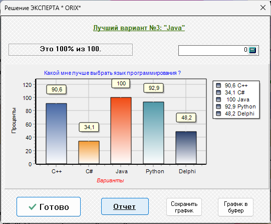
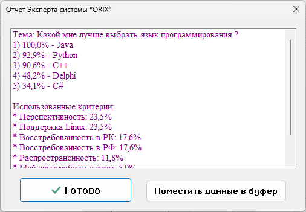

# ORIX – органайзер дел и событий

**ORIX** — многофункциональный персональный органайзер, предназначенный для планирования, учёта, оптимизации и контроля рабочего и свободного времени. Программа помогает находить наиболее свободные и загруженные дни, формировать сводные отчёты о предстоящих событиях и праздниках, наглядно отображать срочные дела, а также отслеживать задания, срок исполнения которых истёк. Реализована возможность переноса выполненных дел в архив.

Начиная с версии 2.0 серии «Profile» в программе реализована поддержка профилей пользователей.

Особенностью программы является подсистема **«ЭКСПЕРТ дел и поступков»** — интеллектуальный помощник, который на основе указанных вами критериев и их важности помогает выбрать оптимальный вариант решения из нескольких возможных. Подсистема использует математические расчёты и ваши собственные предпочтения, чтобы предложить наиболее подходящее решение.

## Авторские права и условия использования

**© 2026 Талипов Сергей Николаевич**

Программа «**ORIX – органайзер дел и событий**» является объектом интеллектуальной собственности автора.  
Все права защищены.

Программа официально зарегистрирована в Государственном реестре прав на объекты, охраняемые авторским правом Республики Казахстан.

### Разрешено
- Бесплатно использовать готовую (скомпилированную) версию программы **«как есть»** в личных и некоммерческих целях.

### Запрещено без письменного разрешения автора
- Вносить любые изменения в программу
- Проводить декомпиляцию, дизассемблирование или обратную разработку
- Распространять модифицированные версии программы
- Использовать программу в коммерческих целях

Исходный код программы **не распространяется** и является конфиденциальным.

При возникновении вопросов обращайтесь: **talipovsn@gmail.com**